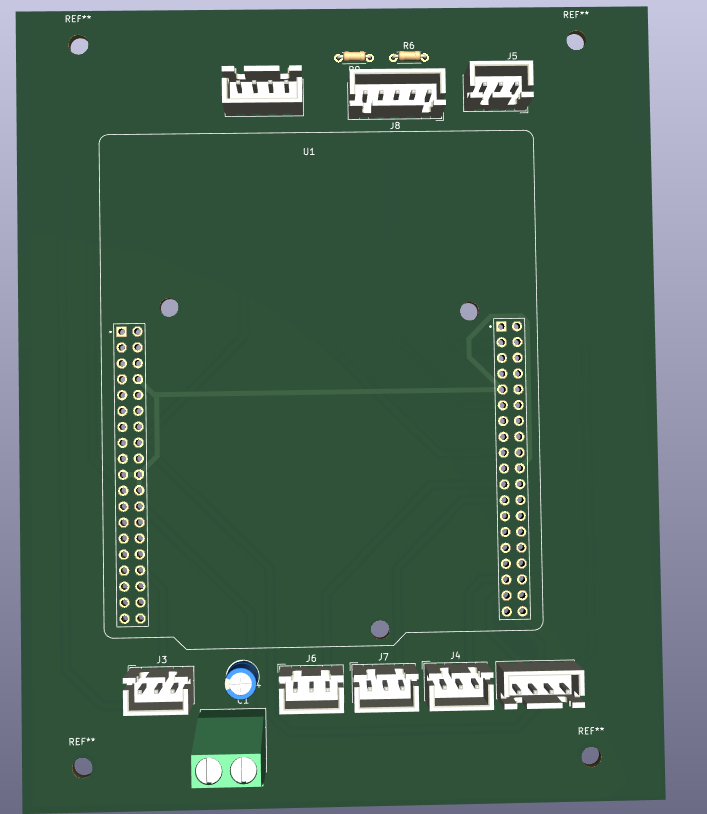
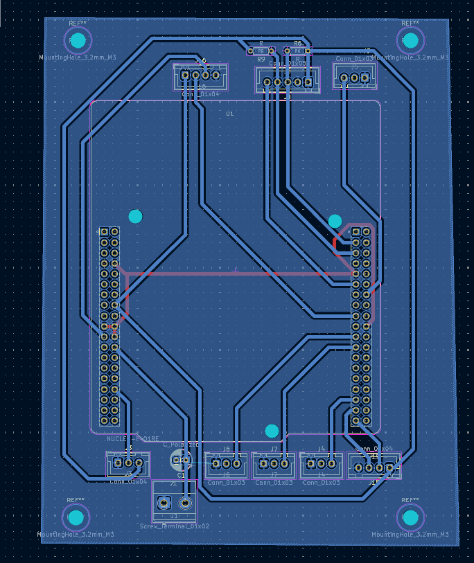
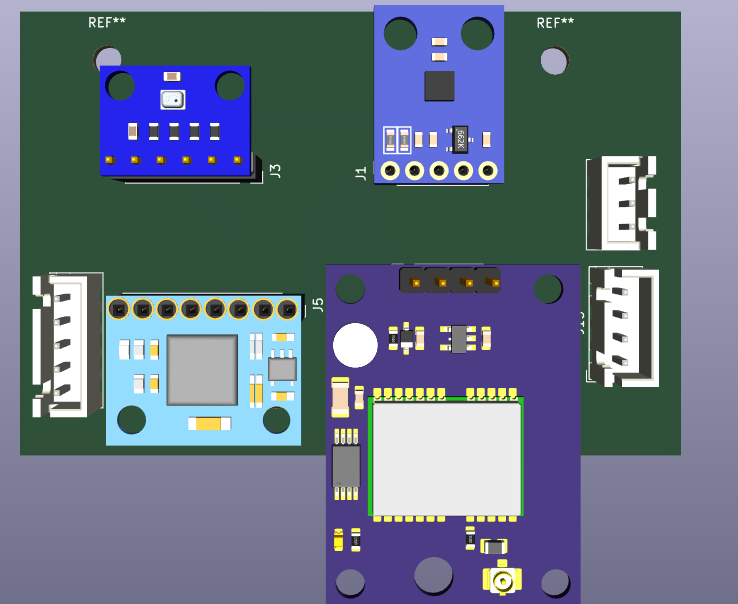
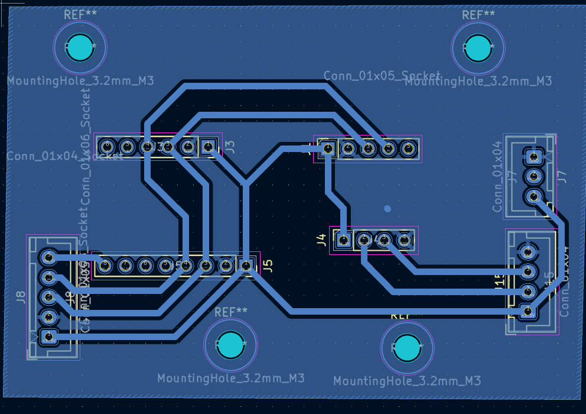

This Repo will follow me while i m impelmenting a flight controller using stm32 blue pill board. I will be using the following components:
- STM32F103C8T6 (Blue Pill)
- MPU6050 (Gyro and Accelerometer)
- IA6S (Receiver)
- Flysky FS-iA6B (Transmitter)
- bmp280 (Barometer)
- HMC5883L (Magnetometer)
- ESCS (Electronic Speed Controllers)
- Brushless Motors
- Neo6m (GPS)

the first version should be capable of flying a quadcopter and maintain its position in the air:
- I would try my best to make the code as modular as possible so that it can be easily modified and extended in the future. I will be using OOp based design patterns to ensure the modularity, so the code will contain both C and C++
- Software architecture will be based on the layered architecture pattern, where each layer will have a specific responsibility and will communicate with other layers through well-defined interfaces. The layers will be as follows:
- Hardware Abstraction Layer (HAL): This layer will be responsible for abstracting the hardware details and providing a unified interface for the upper layers to interact with the hardware components. It will include drivers for the sensors, ESCs, and other peripherals.
- Control Layer: This layer will be responsible for implementing the control algorithms for the flight controller. It will include the PID controller, sensor fusion algorithms, and other control logic to maintain the stability of the quadcopter.
- Application Layer: This layer will be responsible for implementing the high-level logic of the flight controller, such as handling user input from the transmitter, managing flight modes, and implementing safety features.
- Communication Layer: This layer will be responsible for handling communication between the flight controller and other devices, such as the transmitter and GPS module. It will include protocols for receiving commands from the transmitter and sending telemetry data back to the transmitter or other devices.

## Architecture Overview

The flight controller is designed using a layered architecture pattern combined with object-oriented design principles to ensure modularity, maintainability, and extensibility. 

### Project Structure

```
flight_controller/
├── App/
│   ├── Blogic/                 # High-level application logic
│   │   ├── Inc/: FlightController, Drone, Config
│   │   └── Src/: implementations
│   ├── Communication/          # RC receiver, GPS, telemetry
│   │   ├── Inc/: RCReceiver, GPSReceiver, TelemetryManager
│   │   └── Src/: concrete implementations (IA6B, NEO6M, etc.)
│   └── Control/                # Core flight control system
│       ├── Sensors/            # Sensor abstraction & fusion
│       │   ├── Inc/: Filter, Barometer, IMU, Magnetometer, StateEstimator
│       │   └── Src/: concrete sensor implementations (MPU6050, BMP280, GY273)
│       ├── Controller/         # Control algorithms
│       │   ├── Inc/: PIDController, MotorController, ControlSystem
│       │   └── Src/: control implementations
│       └── Filters/            # Sensor fusion filters
│           ├── Inc/: ComplementaryFilter, KalmanFilter
│           └── Src/: filter implementations
├── Core/                       # STM32 HAL and system files
├── Drivers/                    # STM32 HAL drivers and CMSIS
└── app_drivers/               # Custom low-level drivers
```

### Layered Architecture

**1. Hardware Abstraction Layer (HAL):**
- Located in `Core/` and `Drivers/` - STM32CubeIDE generated HAL drivers
- Located in `app_drivers/` - Custom drivers for MPU6050, BMP280, SBUS receiver

**2. Control Layer (App/Control/):**
   
   a) **Sensors Subsystem** (`Control/Sensors/`):
   - Abstract base classes: `Filter`, `Barometer`, `IMU`, `Magnetometer`
   - Concrete implementations: `Barometer_bmp280`, `IMU_MPU6050`, `Magnetometer_GY273`
   - `StateEstimator`: Sensor fusion engine combining all sensors to produce estimated drone state (attitude, altitude, heading)
   
   b) **Filters Subsystem** (`Control/Filters/`):
   - `Filter`: Abstract base class for signal filtering
   - `ComplementaryFilter`: Implemented sensor fusion filter combining gyro and accelerometer data
   - `KalmanFilter`: Abstract placeholder for advanced Kalman filtering
   
   c) **Controller Subsystem** (`Control/Controller/`):
   - `PIDController`: Proportional-Integral-Derivative controller with integral windup prevention and output saturation
   - `MotorController`: Motor mixing algorithm for quadcopter X-configuration (4 motors)
   - `ControlSystem`: Coordinates 4 PID controllers for roll, pitch, yaw, and altitude stabilization

**3. Application Layer (App/Blogic/):**
- `FlightController`: Orchestrates sensor fusion and motor control (main control loop)
- `Drone`: High-level flight operations and state management
- `Config`: Configuration and flight mode management

**4. Communication Layer (App/Communication/):**
- `RCReceiver` (abstract) with `RC_Receiver_IA6_B` (concrete): 6-channel RC signal receiver
- `GPSReceiver` (abstract) with `GPSReceiver_Neo_6M` (concrete): GPS positioning
- `TelemetryManager` (abstract) with implementations for telemetry logging

### Data Flow

```
RC Transmitter (IA6B)
      ↓
RCReceiver (6-channel commands)
      ↓
    Drone (application logic)
      ↓
FlightController (control loop)
      ↓
StateEstimator (sensor fusion)     ← Sensors: MPU6050, BMP280, GY273
      ↓
ControlSystem (PID controllers)
      ↓
MotorController (mixing & PWM)
      ↓
ESCs → Motors
      ↓
TelemetryManager (logging)
```

### Key Design Principles

- **Abstraction**: Each layer communicates through abstract interfaces, allowing components to be independently tested and replaced
- **Modularity**: Sensor, filter, and control subsystems are physically separated in folder structure for better organization
- **Extensibility**: New sensor types (e.g., optical flow) can be added by implementing the abstract interfaces
- **Separation of Concerns**: 
  - Sensors folder handles all sensor I/O and calibration
  - Filters folder manages data fusion algorithms
  - Controller folder focuses purely on control logic
  - Communication layer decouples from core flight logic

### Component Dependencies

- `StateEstimator` depends on: `Filter`, `Barometer`, `IMU`, `Magnetometer`
- `ControlSystem` depends on: `PIDController`, `StateEstimator`
- `MotorController` depends on: PWM hardware interface
- `FlightController` depends on: `MotorController`, `ControlSystem`, `StateEstimator`, `GPSReceiver`
- `Drone` depends on: `FlightController`, `RCReceiver`, `TelemetryManager`

---

## PCB Design

The flight controller system consists of two interconnected shield boards designed in KiCad to expand and organize the functionality of the STM32F401RE microcontroller:

### 1. STM32 Shield

The STM32 Shield is the main control board that interfaces with the STM32F401RE microcontroller. It houses the core power management, signal conditioning, and motor control circuitry.

**3D View:**


**PCB Routing:**


**Key Features:**
- ESC PWM signal outputs for motor control
- Power distribution and regulation
- Signal conditioning for RC receiver input
- UART/communication interfaces

### 2. Sensors Shield

The Sensors Shield is a dedicated daughter board housing all the sensor modules required for flight control and navigation.

**3D View:**


**PCB Routing:**


**Integrated Sensors:**
- **MPU6050**: 6-axis IMU (3-axis gyroscope + 3-axis accelerometer)
- **BMP280**: Barometer for altitude estimation
- **HMC5883L**: 3-axis magnetometer for heading
- **NEO6M**: GPS module for position-based flight modes
- **SBUS Receiver Interface**: Flysky FS-iA6B receiver integration

### Board Integration

The two shields are stacked together using connector headers, providing a modular and organized hardware platform:
- STM32 Shield acts as the main control and power distribution hub
- Sensors Shield provides isolated sensor measurement and preprocessing
- Isolated I2C and SPI buses minimize interference
- Common power and ground distribution between boards

---

## Architecture Overview (Original)

The flight controller at the top level uses the Drone class as the central aggregator that coordinates three primary functional domains: command input through the RCReceiver hierarchy, flight control through the FlightController class, and telemetry logging through the TelemetryLogger hierarchy. The RCReceiver operates as an abstract interface with concrete implementations like the IA6B class, enabling seamless integration of different receiver protocols and providing normalized command channels for throttle, roll, pitch, yaw, and flight mode selection. The TelemetryLogger uses the strategy pattern with abstract and concrete implementations (OnboardLogger for SWD/STLink-based logging and SimulationLogger for PC-based testing), allowing flexible data logging across different environments without coupling the core flight logic to any specific logging mechanism. The FlightController represents the brain of the system, aggregating four critical subsystems: the ControlSystem hierarchy (with PIDController as the concrete implementation) that processes sensor data and RC commands to generate stabilization outputs; the StateEstimator (sensor fusion engine) that aggregates the IMU (MPU6050), Barometer (BMP280), Magnetometer (GY273), and Filters (Kalman-based) to compute accurate drone attitude, altitude, and heading; the MotorController that converts control outputs into PWM signals for the ESCs; and the optional GPSReceiver (NEO6M) for position-based flight modes. This architecture establishes a clean data flow: RC inputs and sensor measurements feed into the state estimator, which produces a current state estimate; the control system consumes this state estimate and RC command inputs to compute desired motor outputs via PID control; the motor controller translates these outputs to ESC commands; and telemetry components log this entire process. The extensive use of abstract classes ensures that each component can be independently tested, replaced, or extended (e.g., swapping the Kalman filter for a complementary filter), while the layered separation maintains hardware abstraction at the bottom, control algorithms in the middle, and high-level application logic at the top—all communicating through well-defined interfaces.